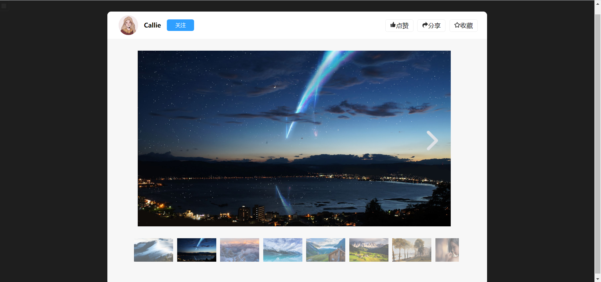

# 仿flash幻灯片效果

**项目简述：**仿flash幻灯片/相册图片预览。

**实现效果：**

1.鼠标无操作时，自动播放图片；

2.鼠标滑入左区域，显示“向左切图”按钮，右区域效果相同；

3.点击按钮切换下一张/上一张图片；

4.当切换到下一张图片时，下方预览小图高亮显示当前图片，其他图片进行颜色变浅处理，并使当前图片的预览小图处于中间位置；

5.当图片播放到最后一张，图片自动跳到第一张。

**开发语言：** html+css+javascript

## 预览：

